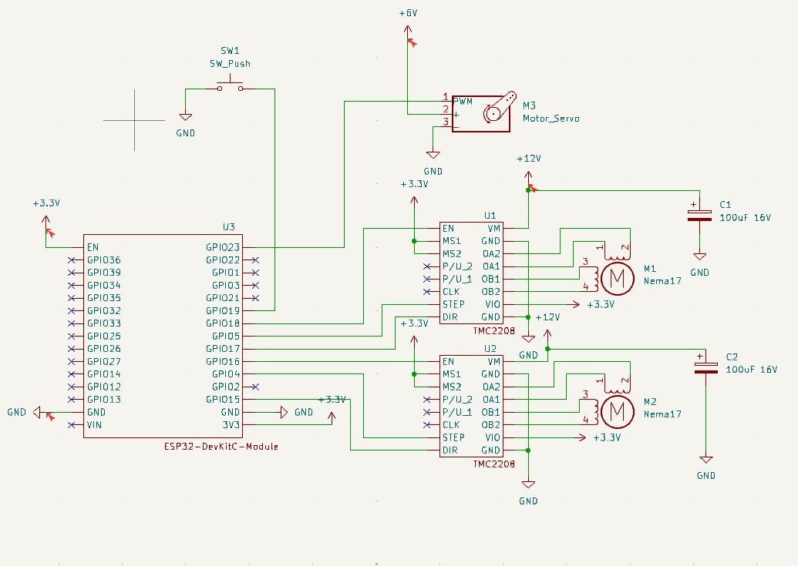

# Generic MMU for 3D printers

The whole controlling logic can be found at [src/filament_changer.rs](../src/filament_changer.rs).
ESP32 pinout configuration can be found at [src/main.rs](../src/main.rs).

Bill of materials:

| qty | product                                           | link                                                  |
| --- | ------------------------------------------------- | ----------------------------------------------------- |
| 2   | Nema17 17HS4023                                   | https://www.aliexpress.com/item/1005005907696088.html |
| 1   | Bambu Lab 3D printer Part 4-in-1 PTFE Adapter     | https://www.aliexpress.com/item/1005006962712897.html |
| 4   | M4 12mm Hex Bolt                                  |                                                       |
| 1   | MK8 Extruder Drive Gear 9mmx11mm 5mm hole         | https://www.aliexpress.com/item/33001874597.html      |
| 1   | DC 12V to 3.3V 5V 12V Step Down Buck Power Supply |                                                       |
| 1   | DC 12V 3A Power Supply                            | https://www.aliexpress.com/item/1005007419359413.html |
| 2   | BIGTREETECH TMC2208 V3.0                          |                                                       |
| 1   | ESP32 WROOM 32 CH340                              | https://www.amazon.de/dp/B0D9BTQRYT                   |
| 1   | LM2596S DC-DC Power Supply Step Down              | https://www.amazon.de/dp/B089QJM8KQ                   |

Pseudo schematics:

Note: Stepper A is the filament selector and Stepper B is the one that loads/unloads the filament.
